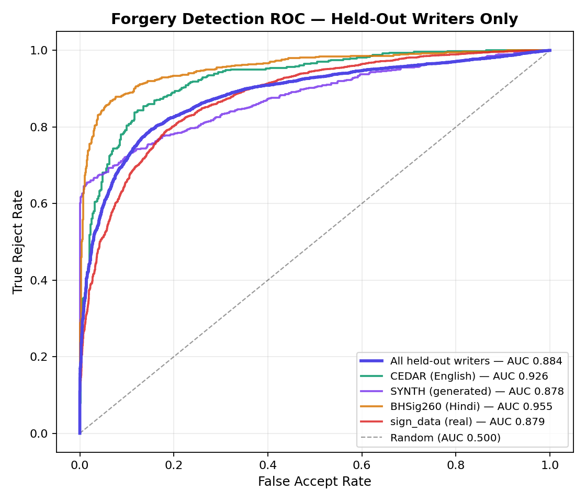
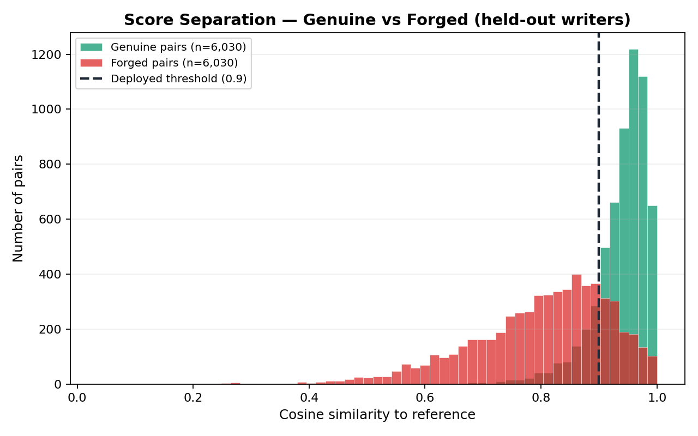
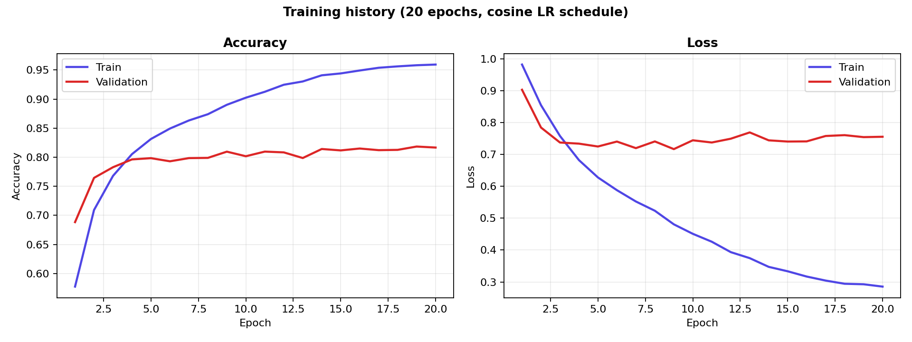

# SignaDrift — Adaptive Aging-Aware Signature Fraud Detection

A signature verification system that understands that **signatures change over time** — and can tell *why* they changed.

Most verification systems treat a signature like a password: compare it to a reference captured at enrollment, apply a fixed threshold, accept or reject. That fails real people. Motor control declines with age; arthritis, neuropathy and strokes permanently change handwriting. A 70-year-old customer gets locked out of their own account, and a "rejected — score 0.71" verdict tells a bank officer nothing useful.

SignaDrift separates the two questions:

| Question | Answered by |
|---|---|
| *Is this the same hand?* | Siamese CNN → 128-d embedding, cosine similarity |
| *Why is it different?* | Temporal drift engine → aging / medical / forgery |

---

## The core insight

A medical event and a forgery both break the match. **Stroke tremor tells them apart:**

- A stroke or neuropathy means **loss of motor control** → tremor **rises**
- A forger practicing draws slowly and deliberately → unnaturally smooth strokes → tremor **falls**

Same symptom, opposite cause — and the system responds completely differently: a suspected medical event is **escalated to a human**, a forgery is **rejected and alerted**.

---

## Results

Measured on **201 held-out writers** — a writer-disjoint split, so no writer in these tables appears anywhere in training.

| Evaluation set | Writers | Pairs | ROC-AUC | EER | Accuracy |
|---|---:|---:|---:|---:|---:|
| **All held-out writers** | 201 | 12,060 | **0.884** | **18.4%** | **82.1%** |
| BHSig260 (Hindi) | 31 | 1,860 | 0.955 | 11.0% | 90.1% |
| CEDAR (English) | 16 | 960 | 0.926 | 14.4% | 85.9% |
| sign_data (real) | 127 | 7,620 | 0.879 | 19.9% | 80.3% |
| SYNTH (generated) | 27 | 1,620 | 0.878 | 21.5% | 81.9% |

Genuine pairs score **0.939** mean cosine similarity; forgeries score **0.800** — a 0.139 separation.




Full tables including false-accept / false-reject rates at the deployed operating point: [results/METRICS.md](results/METRICS.md)

> **On methodology:** per-dataset rows are subsets of the single held-out split, not fresh splits of each dataset. Re-splitting an individual dataset leaks training writers into its validation set and inflates AUC to 0.98+ — deliberately avoided here. Reproduce with `python -m training.generate_results`.

---

## Architecture

```
   Signature image (phone photo / scan)
            │
   ┌────────▼─────────┐
   │  PREPROCESSING   │  Otsu binarization → ruled-line removal → crop to
   │                  │  ink → aspect-preserving resize 150×220 → invert
   └────────┬─────────┘
      ┌─────┴──────┐
┌─────▼─────┐ ┌────▼──────────────┐
│ SIAMESE   │ │ STROKE FORENSICS  │  tremor, pressure, speed,
│ CNN       │ │ (OpenCV)          │  consistency, pen-lifts
│ 128-d emb │ └────┬──────────────┘
└─────┬─────┘      │
┌─────▼────────────▼──────┐
│  ADAPTIVE VERIFICATION  │  cosine vs baseline + each reference (top-2 mean)
└─────┬───────────────────┘
┌─────▼───────────────────┐
│  DRIFT ANALYZER         │  regression · volatility · change-point
│  (classical statistics) │  detection · tremor trend
└─────┬───────────────────┘
┌─────▼───────────────────┐
│  DECISION ENGINE        │  approved / escalated / rejected
│                         │  + plain-language explanation
└─────────────────────────┘
```

**Encoder** (2.07M parameters, trained from scratch — no pretrained weights):
4 conv stages (32→64→128→256) with **residual blocks and squeeze-excite channel attention** at three scales, **GroupNorm**, global **max** pooling, FC head → 128-d embedding.

**Training:** contrastive loss on unnormalized embeddings (margin 1.0) with **hard-negative mining** (hardest 25% of each batch weighted double), plus a jointly-trained BCE decision head on `|e₁−e₂|`. Adam, cosine LR annealing, AMP, 20 epochs. Pairs are **resampled every epoch** from ~680k possible combinations rather than recycling a fixed list.



---

## Adaptive decision layer

- **Per-user calibrated thresholds** — at enrollment the system measures how consistent *that person's* own references are with each other (`mean − 2σ`, clamped to 0.84–0.95). Naturally variable signers get a fairer bar.
- **Tenure trust buffer** — long-standing users earn a small threshold reduction, capped.
- **Three-way decisions** — approved / **escalated** / rejected. Borderline scores go to human review instead of a coin-flip rejection.
- **Multi-reference scoring** — compares against the adaptive baseline *and* every reference, taking the top-2 mean.
- **Template-poisoning resistance** — the stored baseline adapts by EMA (90/10) toward newly approved signatures only, so it follows genuine aging drift but a forger cannot gradually walk it toward their own hand.
- **Replay detection** — every image is fingerprinted; resubmitting an identical file is rejected. Real signings are never pixel-identical.

---

## Drift classification

| Class | Condition | Action |
|---|---|---|
| **Forgery attempt** | Short-term scores rising fast **and** tremor dropped | Reject + critical alert |
| **Medical event** | Sudden discontinuity **and** tremor increased | **Escalate** to human review |
| **Natural aging** | Slow negative slope, high R², low volatility | Approve, threshold adapts |
| **Normal** | Everything else | Approve |

Signals: linear regression slope and R² over time, rolling-window volatility, change-point detection (max step-down across all split points), and tremor trend.

Demo the classifier on simulated histories:

```bash
python test_drift.py --scenario forgery
python test_drift.py --scenario medical
python test_drift.py --scenario aging
```

---

## Training data — 1,001 writers, 3 scripts

| Dataset | Writers | Contribution |
|---|---:|---|
| sign_data | 686 | Large real corpus, genuine + forged |
| BHSig260-Hindi | 160 | Devanagari script, real Indian writers |
| CEDAR | 55 | English cursive, skilled forgeries |
| **SYNTH** (built for this project) | 100 | Romanized Indian names in signature style |

### The synthetic generator

Public datasets are American cursive and Devanagari — signatures of *romanized Indian names* were out of distribution. [`training/synth_signatures.py`](backend/training/synth_signatures.py) generates them by modelling how people actually sign, not how fonts print:

- Exaggerated capital (1.2–2.1×) with following letters tucked into it
- Horizontal compression — the half-legible scrawl effect
- Truncation — 30% of writers sign only part of their name
- **Bézier flourishes** — sweeps under the name, cuts through it, loops, underlines
- Per-signing variation: elastic warp, rotation, stroke thickness, ink pressure, paper noise

Forgeries come in three flavours: *random* (different hand), *skilled* (**same letterforms, different personal style** — the family-member-imitation case), and *traced* (right shape, hesitant dynamics).

```bash
python -m training.synth_signatures --out ../dataset/SYNTH --writers 100
```

> Font-derived signatures are more uniform than real handwriting, so SYNTH is a *supplement* — real writers are 90% of the corpus. Training on synthetic alone risks learning font-recognition shortcuts.

---

## Setup

```bash
# Backend
cd backend
python -m venv venv && venv\Scripts\activate
pip install -r requirements.txt
```

PyTorch from PyPI is CPU-only — for GPU training install the CUDA build:

```bash
pip install torch==2.2.2 torchvision==0.17.2 --index-url https://download.pytorch.org/whl/cu121
```

```bash
# Run the API (docs at /docs)
python -m uvicorn app.main:app --reload --port 8000

# Frontend
cd frontend && npm install && npm run dev      # http://localhost:5173
```

Retrain and reproduce the results:

```bash
python -m training.train_siamese --epochs 20
python -m training.evaluate
python -m training.generate_results
```

Thresholds are model-specific — rerun `evaluate` after any retrain and update `BASE_THRESHOLD` in [`app/config.py`](backend/app/config.py).

---

## API

| Endpoint | Purpose |
|---|---|
| `POST /api/users/enroll` | Enroll with 3–5 references → embeddings, stroke features, calibrated threshold |
| `POST /api/verify/` | Verify a signature → decision, scores, drift class, explanation |
| `GET /api/users/{id}/history` | Score/drift timeline for charts |
| `GET /api/verify/alerts` | Active forgery / medical alerts |

**Stack:** PyTorch · OpenCV · SciPy · scikit-learn · FastAPI · SQLite · React · Vite · TailwindCSS · Recharts

---

## Limitations

- **Skilled forgeries of the same name by a closely related writer**, captured as phone photos, remain the hard case — that's where the 18.4% EER sits. Mitigated by two design choices: borderline cases escalate to human review rather than being guessed, and the drift engine catches forgers across *repeated* attempts even when a single attempt slips through.
- Stroke "forensics" are estimated from static images; true pressure and velocity need an online capture device (tablet/stylus).
- Enrollment is assumed trusted and supervised, as with opening a bank account in person.

## Roadmap

- Triplet loss with hard-negative mining
- More real data (BHSig260-Bengali, ICDAR SigComp)
- Fusing stroke forensics into the match score, not only the drift classifier
- Benchmark the from-scratch encoder against a fine-tuned ResNet18 to quantify the trade-off
